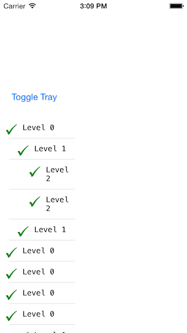
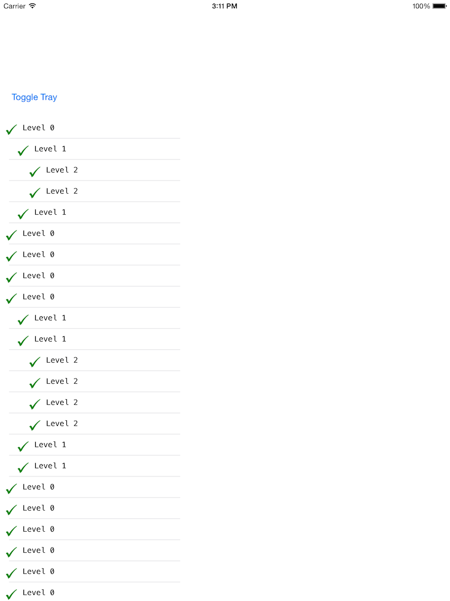

# HamburgerMenu
HamburgerMenu for iOS writtern in swift
Usage
========

1. Drag the `HamburgerMenu` into your project.

2. Create an variable in your `Viewcontroller`
```swift
var slideMenuController: SlideMenuViewController?
```

3. create an instance of `SlideMenuViewController` and add as child view controller
```swift
slideMenuController = SlideMenuViewController()
addChildViewController(slideMenuController)
slideMenuController.view.setTranslatesAutoresizingMaskIntoConstraints(false)
view.addSubview(slideMenuController.view)
slideMenuController.didMoveToParentViewController(self)                                           

view.addConstraints(NSLayoutConstraint.constraintsWithVisualFormat("H:|[slideView]|", options: NSLayoutFormatOptions(0), metrics: nil, views: ["slideView": slideMenuController.view]))
view.addConstraints(NSLayoutConstraint.constraintsWithVisualFormat("V:|[slideView]|", options: NSLayoutFormatOptions(0), metrics: nil, views: ["slideView": slideMenuController.view]))
```

4. Set the datasource of `slideMenuController` to self 
```swift
slideMenuController.datasource = self
```

5. Implement the datasource methods.
```swift
//Mark: DynamicTrayMenuDataSource
func mainViewController() -> UIViewController {
	return storyboard!.instantiateViewControllerWithIdentifier("MainController") as! MainViewController
}
func trayViewController() -> UIViewController {
	return storyboard!.instantiateViewControllerWithIdentifier("TableController") as! TableViewController
}
```

Screenshots
========
<center></center>
<center></center>

License
========
The MIT License (MIT)

Copyright (c) 2015 Lancy

Permission is hereby granted, free of charge, to any person obtaining a copy
of this software and associated documentation files (the "Software"), to deal
in the Software without restriction, including without limitation the rights
to use, copy, modify, merge, publish, distribute, sublicense, and/or sell
copies of the Software, and to permit persons to whom the Software is
furnished to do so, subject to the following conditions:

The above copyright notice and this permission notice shall be included in
all copies or substantial portions of the Software.

THE SOFTWARE IS PROVIDED "AS IS", WITHOUT WARRANTY OF ANY KIND, EXPRESS OR
IMPLIED, INCLUDING BUT NOT LIMITED TO THE WARRANTIES OF MERCHANTABILITY,
FITNESS FOR A PARTICULAR PURPOSE AND NONINFRINGEMENT. IN NO EVENT SHALL THE
AUTHORS OR COPYRIGHT HOLDERS BE LIABLE FOR ANY CLAIM, DAMAGES OR OTHER
LIABILITY, WHETHER IN AN ACTION OF CONTRACT, TORT OR OTHERWISE, ARISING FROM,
OUT OF OR IN CONNECTION WITH THE SOFTWARE OR THE USE OR OTHER DEALINGS IN
THE SOFTWARE.
